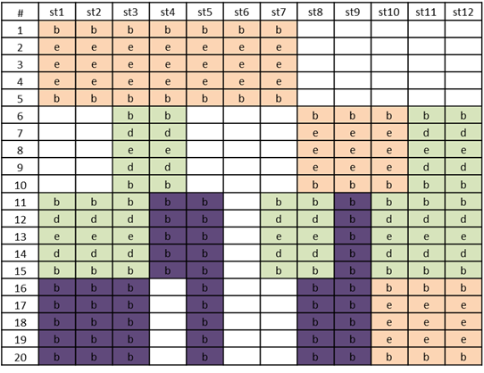
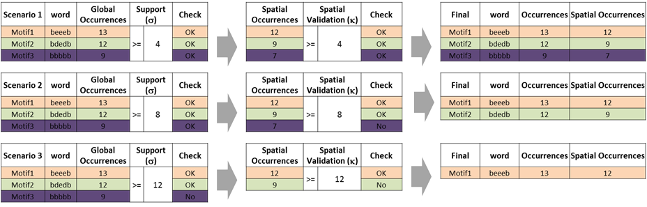
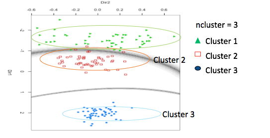

```{r setup, include = FALSE}
knitr::opts_chunk$set(
  collapse = TRUE,
  comment = "#>"
)
```

In this step we have our candidates generated from the original dataset.

## Check the occurrences

We must now validate these candidates. To do this, we will use as a restriction the occurrences.
There are 2 types of occurrences in our approach : `Global occurrences (GO)` and `Spatial occurrences (SO)`

There is possibility to set the filtering with 2 parameters :

- `Sigma` : threshold of the global occurrences
- `Kappa` : threshold of the spatial occurrences

Here an example with 3 scenarios :

- Scenario 1 : kappa = sigma = **4**
- Scenario 2 : kappa = sigma = **8**
- Scenario 3 : kappa = sigma = **12**

```{r, echo=FALSE, fig.cap="Example of encoded spatial-time series", out.width = '100%'}

```

```{r, echo=FALSE, fig.cap="Result of the 3 scenarios", out.width = '100%'}

```

## Filter motifs

Filter motifs by removing isolated motifs and rechecking occurrences.

To found these isolated motifs we use the cluster method.

```{r, echo=FALSE, fig.cap="Cluster method", out.width = '100%'}

```

If the motif does not have a neighbor then it is deleted. After that when all isolated motifs are deleted, we recheck like the previous step the occurrences.
