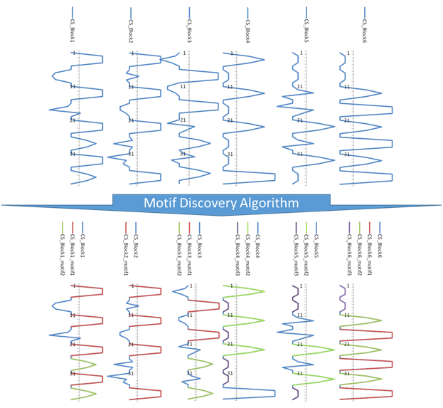

```{r setup, include = FALSE}
knitr::opts_chunk$set(
  collapse = TRUE,
  comment = "#>"
)
source("../R/subFunction.R")
```

The purpose of this documentation is to understand how `candidates are generated`.
To do this, before applying the process, there is a step of preparing the dataset. After that, the process can be started. The goal in the end is to find the candidates and gather all the necessary information.

## Presentation of the process

The process is composed by several steps :

1. Normalization
2. Symbolic Aggregation ApproXimation (SAX)
3. Partitioning spatial-time series into blocks
4. Combination of bloked spatial-time series
5. Combined Series Approach


## Description of each step

### Normalisation

This step is fundamental to ensure that the data is in the same scale / basis.
To do this normalisation the method `Z-score` is used.

```{r, echo=TRUE}
head(STMotif::example_dataset[,1:10])
head(round(STSNormalization(vector = as.matrix(STMotif::example_dataset)),digits = 2)[,1:10])
```


### Symbolic Aggregation ApproXimation (SAX)

The observations of subsequences trends to be normally distributed. Thereby, the discretization space is made over the Gaussian curve in different intervals with same probability.
To encode values, we must give a number of letters in the alphabet.

```{r, echo=FALSE, fig.cap="SAX Encoding with 3 letters", out.width = '100%'}
knitr::include_graphics("saxencode.png")
```

### Partitioning spatial-time series into blocks

This step divides the original dataset into blocks. To give a shape to the blocks, there are 2 parameters (Spatial Slice and Time Slice).

```{r, echo=FALSE, fig.cap="Blocks creation", out.width = '100%'}
knitr::include_graphics("partitioningintoblocks.png")
```

### Combination of bloked spatial-time series

The goal of this step is to create time series from blocks.
After this combination, the spatial-time series present in the block are transformed into time series. After that we can use existing tools to find the candidates.

```{r, echo=FALSE, fig.cap="Combine the spatial-time series into the block", out.width = '100%'}
knitr::include_graphics("combineseries.png")
```

### Combined Series Approach

Now we can run the `motif discovery algorithm` and find the candidates.

```{r, echo=FALSE, fig.cap="Application of motif discovery algorithm", out.width = '100%'}

```
