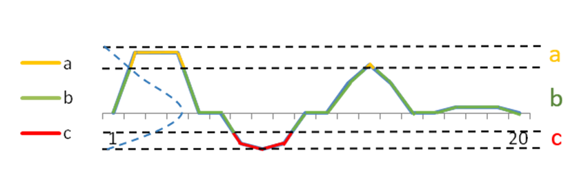

```{r setup, include = FALSE}
knitr::opts_chunk$set(
  collapse = TRUE,
  comment = "#>"
)
source("../R/mainFunction.R")
```

The purpose of this documentation is to understand how the `Normalization & SAX indexing` step works.
The goal of this step is prepare the dataset to the process. 


## Description 

### Normalization

This step is fundamental to ensure that the data is in the same scale/basis.
To do this normalization the method `Z-score` is used.


### Symbolic Aggregation ApproXimation (SAX)

The observations of subsequences trends to be normally distributed. Thereby, the discretization space is made over the Gaussian curve in different intervals with the same probability.
To encode values, we must give a number of letters in the alphabet.

```{r, echo=FALSE, fig.cap="SAX Encoding with 3 letters", out.width = '100%'}

```


## Example


```{r, echo=TRUE}
head(STMotif::example_dataset[,1:10])
head(NormSAX(D = STMotif::example_dataset, a = 7)[,1:10])
```

