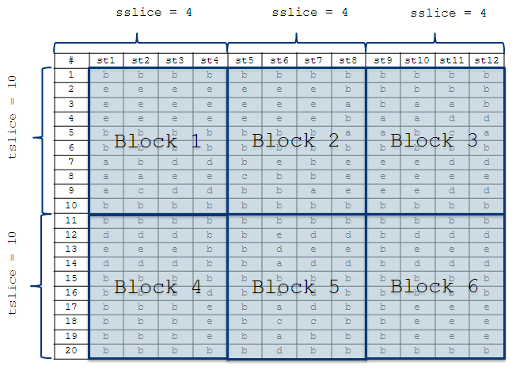
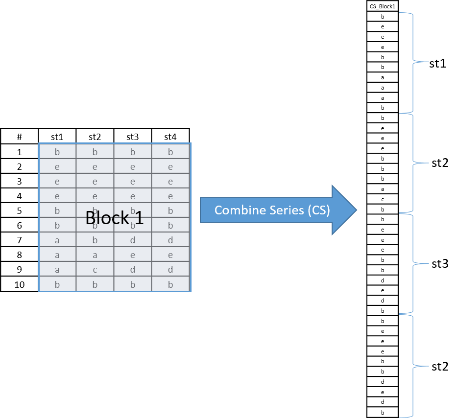

```{r setup, include = FALSE}
knitr::opts_chunk$set(
  collapse = TRUE,
  comment = "#>"
)
source(file = "../R/mainFunction.R")
source(file = "../R/subFunction.R")
```

The purpose of this documentation is to understand the second step of CSA data minig process correspond to **SearchSTMotifs** function. In this function, the spatial-time dataset DS is partitioned into blocks, created based on `sb` (spatial block size) and `tb` (temporal block size).   


```{r, echo=FALSE, fig.cap="Blocks creation", out.width = '70%'}

```  


All subsequences inside each block are combined into a single time series called combined series (`cs`).  


```{r, echo=FALSE, fig.cap="Combine the spatial-time series into each block", out.width = '70%'}

```  


Analysing the `cs`, all subsequences of size `w` are evaluated. If the number of occurrences of each sequence is greater than `sigma` and the number of distinct spatial-time series for them are greater or equal to `kappa`, then his position are registered at a list of stmotifs. 

All motifs that are identified inside a block are local block motifs. These motifs are merged such that all occurrences of each motif are grouped as long as they occur in neighbor blocks. In the end, each motif has as information:
* isaxcode: Motif sequences in character format
* recmatrix: Matrix giving as information the blocks containing this motif
* vectst: Coordinate of the start positions of the motif in the original dataset


### Example 

```{r, echo=TRUE}
head(SearchSTMotifs(STMotif::example_dataset,NormSAX(STMotif::example_dataset,7),3,7,10,10,3,10))
```

